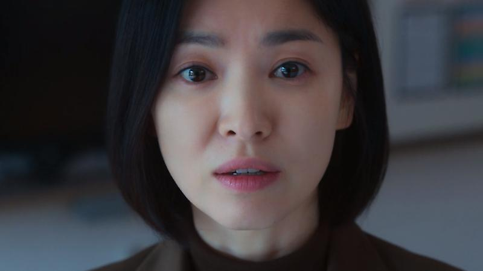
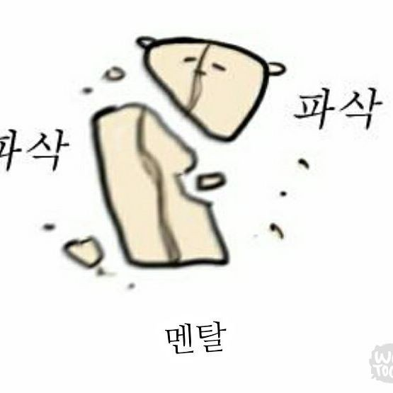
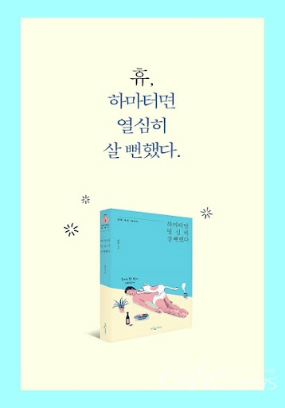
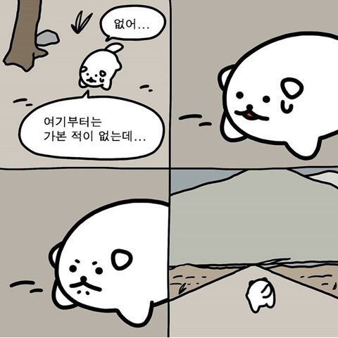

# 낭만 개발자 성장기 

### 안녕하세요, 반란군이 되고 싶은 테바입니다. 

우테코에 가면 뭐가 제일 좋냐고 많이들 물어본다. 그때마다 나는 한결같이 포비라고 대답한다.

귀인은 한 사람의 운명을 바꾼다고들 한다. 거짓말이 아닌게 성공한 사람들은 꼭 주변에 한명씩 귀인이 있더라. 성인이 되고 근 8년간 내 가치관은 여러사람들에 의해 수차례 변해왔다. 그리고 우테코에서 20대 마지막 귀인을 만났다.

  
  포비야, 내꿈은 너야

 

나이 50넘은 아저씨 한테 뭘 배우냐고 물을 수도 있다. 하지만 포비는 내가 만난 그 어떤 청년보다도 젊다. 그리고 그의 가치관에 매료되었다. 더 정확하게는, __내가 추구하는 삶의 정상을 미리 보았다__ 고 할 수 있겠다.

> 저는 반항아적인 기질이 좀 있는 사람이라고 생각해요 - 포비

나도 그렇다. 애석하게도 알게 된 것은 그렇게 오래되지는 않았지만. 

### 반란군을 깨우다 
우리 학교는 컴공을 그렇게 밀어주는 학교가 아니다. 18년도에 입학한지 5년이나 되어서야 제대로된 개발 학회가 생긴 것 보면 말다했다. 그리고 나도 여느 학생과 다르지 않게 컴공인데 개발할 줄 모르는 학생이었다. 

3학년 2학기에 들어서면서 정신을 차린건지 아니면 뭐라도 씌였는지 한 일년간을 미친듯이 개발공부를 했다. 학기 중 동아리 활동 2개를 기본에 프로젝트는 2-3개씩 병행하며 하루에 3시간씩 자면서 거의 죽어가던게 기억이 난다. 이제와서 보면 이력서 스펙 한 두줄 채워넣을까 말까 싶다. 

  

 

그렇게 1년을 개고생 하고 남은 것은 낡아버린 몸과 정신 뿐 이었다. 회사는 지원하는 족족 떨어지면서 맨탈이 갈려나가고 뭐가 부족한가 싶어서 잠을 줄이면 몸이 망가졌다. 

> 왜 이렇게 살지? 이게 맞나?

그러다 문득 이런 생각이 들었다. 근 일년간 행복했던 기억이 별로 없었다. 결단이 필요했다. 

  

 

생각해보면 그렇다. 남들이 사는데로 살면 그게 행복일까? 대기업에 취업하고, 연봉 1억 넘고, 내 집 있고 차 있으면 행복할까? 신기하게, 가져본 것도 아닌데도 아니라고 대답했다. 그래서 반대로 열심히 살지 않아보았다. 모두가 가장 열심히 투자하는 시기인 4학년 마지막 학기 때의 일이다.

동아리 활동을 멈추고, 프로젝트를 줄였다. 약 6개월 간을 어떠한 취업준비도 하지 않았고 회사에 지원하지도 않았다. 재밌게도, 전혀 불안하지 않았다. 오히려 몸과 마음이 돌아오기 시작했다. 시끄러운 소리를 끄고나니 내가 뭘 하고싶은지 들렸다.

쉬고 싶을 땐 쉬고 날씨 좋으면 산책도 하고 사람도 만났다. 그리고 하고 싶은 개발만 했다. 주춤하던 개인 프로젝트를 완성시켰고 300명의 사용자에게 피드백을 받으며 8번의 버전 업데이트를 했다. 좋은 프로그램을 만들어줘서 고맙다는 피드백을 받을 때, 개발하기 참 잘했다는 생각을 했다. 

그리고 6개월이 다 지나갈 때 즈음 우테코에 합류했다.

### 포비와의 만남 
사실 우테코에 대단한 욕심이 있지는 않았다. 4기에 떨어진 기억이 있어서 망설이다 마감 10시간 전에 자소서를 쓰기 시작했다(1년 동안 준비한 크루들도 있다는데 뭔가 좀 미안..). 그래도 프리코스 만큼은 부끄럽지 않게 또 즐겁게 보냈고, 고맙게도 소중한 기회를 얻게 되었다. 그리고 드디어 포비를 만났다.

  

 

> 여러분 우테코가 도움이 안될 것 같으면 때려치세요. 그리고 정말 하고 싶은 것, 자기가 성장할 수 있는 일을 찾으세요. 대신 여러분은 성인이니까 선택에 책임을 지시면 됩니다.

포비의 많은 말 중에도 제일은 단연 우테코를 나가라는 이야기였다. 그리고 그 한마디로 포비가 어떤 삶을 살았을지 짐작할 수 있었다. 

> 성과 증명 마인드 셋 vs 학습 마인드 셋

우테코에서 가장 먼저 배운 것은 객체지향도, 테스트 코드도 아니다. 냅다 첫날에 연극부터 시키더니 나중에 한다는 소리가 "나는 어떤 마인드 셋을 가졌냐" 였던 건 괘씸했지만 좋은 인사이트를 얻었다.

내가 하고싶은 일, 성장하고 싶은 일에 몰입하는 것. 남들의 기준이 아니라 내가 목표하는 것만 보고 정진하는 것. 포비라는 확실한 성공케이스를 근거삼아 어렴풋했던 가치관을 분명하게 했다. 

### 반란군은 낭만이다
반란군으로서 사는 건 나태하게 사는 것과 조금 다르다. 23년 하반기의 내 태도는 다수의 기준에 비추어 볼 때 최선은 아니었다. 그럼에도 그때 나는 분명 몰입의 시간을 보내왔다고 자신 있게 말할 수 있다. 하고 싶은 일에 최선을 다했고 후회가 없으니까.

너무 열심히 하고 싶진 않다고 코치에게 말했던 것이 기억난다. 또 의식적으로 연습하기 위해 더 버리는 것도 해보고 있다. 최근에는 지속해오던 알고리즘 공부, cs 공부도 하지 않고 있다. 우테코에서 프로그래밍 자체를 즐기는 것으로 만족한다. 

  

 

반란군처럼 사는 것, 세상의 기준에 의문을 품어보는 것은 쉽지 않다. 가본적 없는 길이라서 두렵고 그래서 배로 즐겁다. 아는 맛보다는 모르는 맛에 더 즐거움을 느끼는 사람이라면 한번쯤 포비처럼 살아보는 것도 낭만 아닐까.