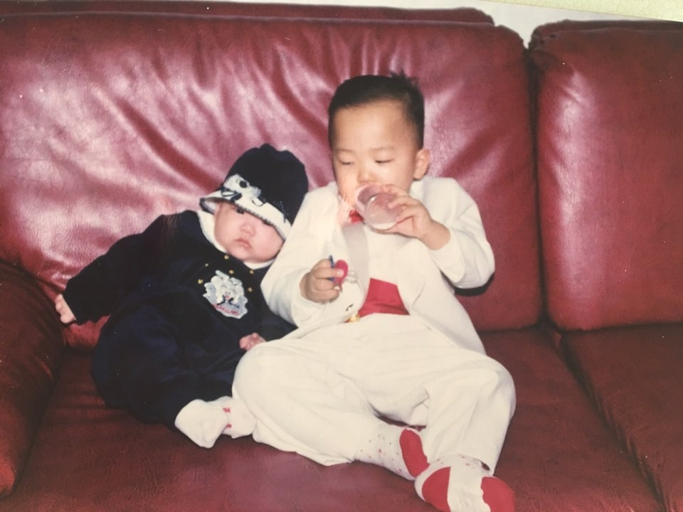
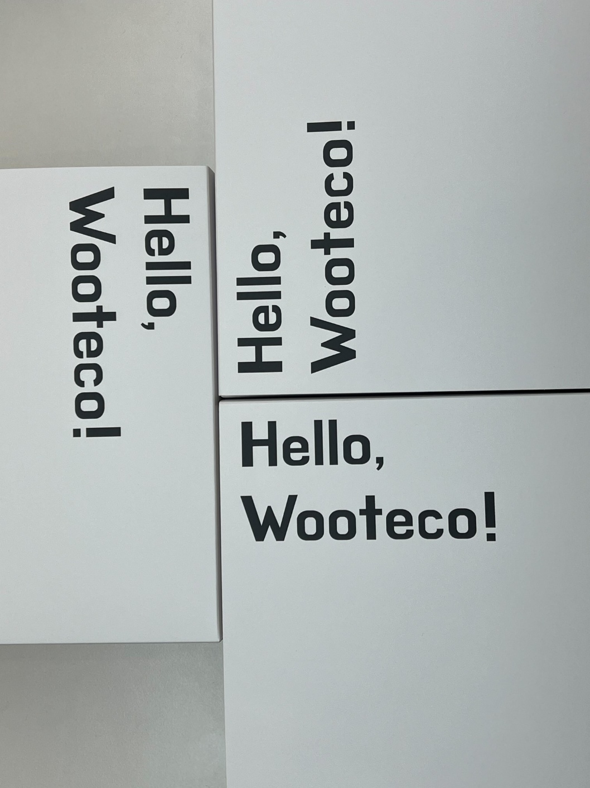
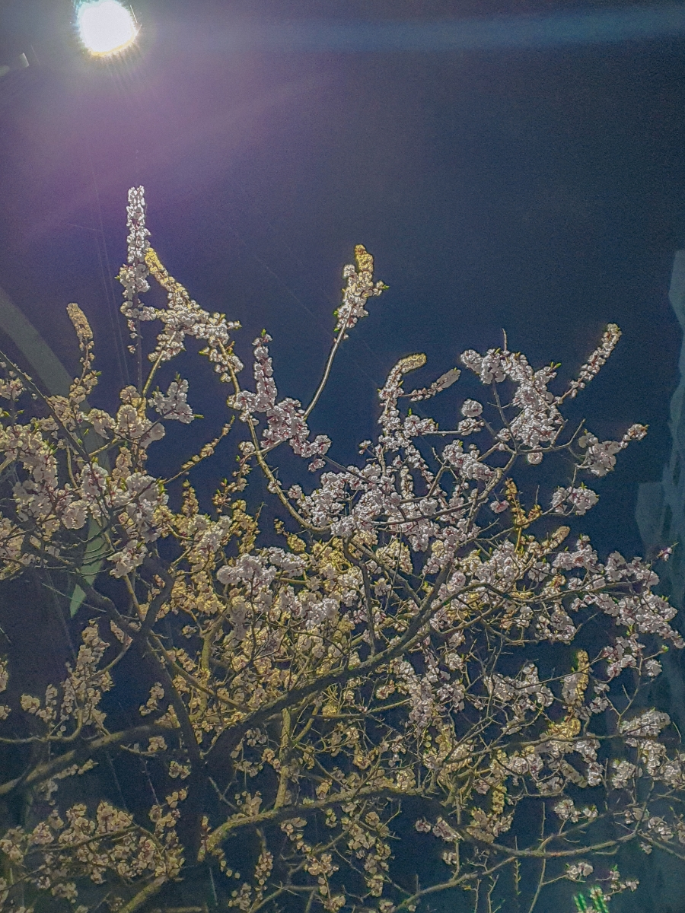

# woowa-writing

# 자신감과 자만감은 한 끗 차이다.

> '지금의 나는 자신감이 가득한 사람일까 아니면 자만심에 가득 찬 사람일 뿐일까.'

요사이에 굉장히 많이 생각이 드는 부분을 한 문장으로 표현한 것이다. 누군가는 나를 자신감 넘치는 사람, 또 다른 누군가는 자만심에 쩔어 오만한 사람으로 판단할 지도 모른다. 그리고 이런 모습을 안좋게 생각한다면, 그것도 그 사람이 나와 다르기 때문일 뿐, 내가 틀려서 그렇다고 생각하지 않는다.

그렇다면 내가 자만심에 차있기 때문에 내가 틀렸다고 생각하지 않는 것인가? 이렇게 물음은 끝이 없어졌고, 더욱 파고 들어 내 안의 심연을 들여다 볼 용기를 내지 못하고 있었다.
그러던 중 우아한테크코스를 만나게 되었고, 개발자를 위한 소프트 스킬 교육을 듣게 되었다. 이런 고민이 들던 내게 소프트 스킬 교육은 그저 개발자로서의 모습을 위한 것이 아닌, 멈추었던 근원적인 고민의 싹을 다시 틔워주었다.

어디선가 본 적이 있는 문구가 있다
> 생각하고 말로 내뱉는 것은 휘발되어 없어지기에 인간은 휘발되버린 것들에 대한 막연한 불안감을 가지게 된다.

라고. 그렇기에 글로 적게 된다면 추상적으로만 존재했던 생각과 관념들이 정리되며 안정감을 찾는다고 한다.

그래서 글쓰기로써 스스로를 돌아보는 시간을 가져보고자 한다.
이 글이 변화하는 내 모습의 꾸준한 1년 기록의 첫걸음이 되길 바란다!
~~시작이 절반이라니까 벌써 반은 했다.~~
## 0. 돌아보기


2남 1녀 중 장남. 유복한 환경에서 큰 오빠, 큰 형, 부모님에게는 장남으로 항상 많은 기대를 받으며 자라왔다.
그래서 그런지 항상 기대에 부응하려고 했고, 기대에 대한 부응은 어느새인가 몸에 자리 잡았다.
또 운이 좋게도 나쁘지 않은 머리를 받아 태어났는지 웬만하면 기대에 부응할 수 있었다. 차라리 벽을 느꼈다면 포기가 빨랐겠지만 그러지는 않아 항상 목표에 도달하고픈 욕심을 가졌었다. 그렇기에 남한테 지는 것에 굉장히 자존심을 상해했고, 안달 내는 것이 몸에 베었다. 소프트 스킬 강의에서 들었던 `성과 증명 마인드셋` 그 자체였던 것이다.

유년기과 청소년기는 이렇게 지나갔다.

그렇게 자존심과 욕심 때문에 재수를 했고, 나쁘지 않은 대학에 들어갔지만 달라진 것 없었다. 남들보다 잘나고 싶었고, 특출 나고 싶었다. 항상 남들보다 더 잘하고 싶다는 욕심을 원동력으로 20대의 대부분을 지내왔다. 하지만 욕심 때문에 이것저것 해보았던 경험은 양날의 검이 되어 돌아왔다. 경험을 통해 많은 것을 배웠지만 결론적으로는 남들보다 조금은 늦게 사회에 나오게 된 것이다.

그렇게 대학에서 벗어난 사회의 첫 발로 우테코를 딛게 되었다.


## 1. 그래서 지금은?



2024년을 시작하며 우연한 계기로 지금까지의 내 태도와 모습을 돌아보는 것의 필요성을 느꼈다. 너무 뚜렷한 주관에 사로잡혀 있지는 않은지, 혹시나 보편에서 내가 떨어져 있는 사람은 아닌지 돌아보기 시작했다. 또한, 모든 사람은 틀린 것이 아닌, 다를 뿐을 외치던 것이 사실은 자기방어 수단이 아니었는지 돌아보았다.

그렇게 내 자신과 주변을 둘러보기를 시작하니, 못보던 것들을 보게 되었다. 나보다 못하다고 생각했던 사람들에게서 배울 점이 있다는 것을 느꼈고, 내가 잘났다고 생각했던 것들이 때로는 하염없이 부족하게 느껴졌다.

그러던 중에 우아한테크코스의 일원이 되어 소프트 스킬 강의와 유연성 강화 스터디를 접하였다.
그렇게 다사다난한 심경 변화를 겪으며 시작했던 내 2024년은 다시 중심을 잡기 시작했다. 더 굳센 중심을 위해 결정한 첫 번째 **유연성 강화 목표**는 이것이다.

> 내가 완벽하지 않고 어딘가는 부족하다는 것을 항상 유념하기

어찌보면 당연하고, 어찌보면 내가 가진 고민을 모두 꿰뚫을 수는 없는 목표이지만 일단 시작은 미약하게 가져보기로 했다. 당연하다고 느끼는 것을 못 느끼고 있었을 지도 모르니.


## 2. 그렇다면 앞으로

부족한 부분이 있다고 해서 스스로를 부족한 사람으로 여기겠다는 소리는 아니다.
'이게 무슨 소리야' 라고 생각할 수도 있지만, 이제서야 제목의 의미를 통해 말해보고자 한다.
우선, 자신감과 자만감이란 무엇일까?
- 자신-감(自信感) : 「명사」 자신이 있다는 감정.

> 여기서 자신(自信)은 '어떤 일을 해낼 수 있다거나 어떤 일이 꼭 그렇게 되리라는 데 대하여 스스로 굳게 믿음. 또는 그런 믿음' 이다.

- 자만-감(自慢感): 「명사」 자신이나 자신과 관련 있는 것을 스스로 자랑하며 뽐낼 만하다는 감정.

> 여기서 눈여겨 볼 것은 자만(自慢) 할 때 만(慢)자는 `게으를 만`을 쓴 다는 것이다. 만족하다의 '만'자가 아닌 것이다.

즉, 자신감은 '부족하지만 결국에는 스스로가 해낼 수 있다는 감정'이고, 자만감은 '스스로가 완벽하다고 생각하여 더 나아지려는 의지가 없는 게으른 상태의 감정'으로 설명할 수 있다.

결국, 두 단어가 자신의 완성을 예상하는 감정인 것은 맞다. 현재의 상태가 똑같이 부족함에도 같은 결과를 바라는지의 차이인 것이다. 아주 사소하지만 아주 큰 변화를 일으킬 현재의 시작점이 다른 것이다.

그런 의미에서 난 현재의 부족함을 끊임 없이 찾아내고, 탐구함으로써 진정한 의미의 `자신감`을 가지려고 한다. 자신감을 통해 더 단단한 자신감을 얻을 수 있을 것이다.
지금의 부족함에 대한 깨달음은 훗날 나에게 자만(自慢)이 아닌, 자신(自信)으로 다가올 것이다.

진심으로 다음 레벨에서 스스로를 돌아보며 쓸 글에서 바뀐 내 모습을 찾아볼 수 있기를 바란다.

재수 시절 지루한 공부를 피해 의미없이 문제집을 뒤적거리다 알게된, 그리고 기억 속에 깊은 의미로 남게된 하나의 시를 소개하며 글을 마무리 하고자 한다.

결국 돌고 돌아도 하나의 종착지로 가게 된다는 의미를 가진 시다.



```
푸른밤
                                           - 나희덕

너에게로 가지 않으려고 미친 듯 걸었던
그 무수한 길도
실은 네게로 향한 것이었다

까마득한 밤길을 혼자 걸어갈 때에도
내 응시에 날아간 별은
네 머리 위에서 반짝였을 것이고
내 한숨과 입김에 꽃들은
네게로 몸을 기울여 흔들렸을 것이다

사랑에서 치욕으로,
다시 치욕에서 사랑으로,
하루에도 몇 번씩 네게로 드리웠던 두레박

그러나 매양 퍼올린 것은
수만 갈래의 길이었을 따름이다
은하수의 한 별이 또 하나의 별을 찾아가는
그 수만의 길을 나는 걷고 있는 것이다

나의 생애는
모든 지름길을 돌아서
네게로 난 단 하나의 에움길이었다
```

