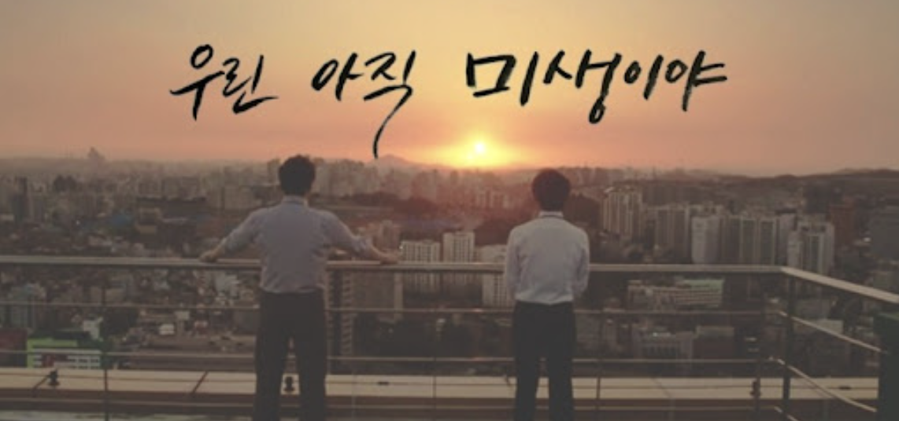

# 악그래의 미생 🐊 (Ep 1)

> ## 제 1국. 놓여진 수
- 새로운 수를 놓기 전에는 이미 놓여진 수를 읽어야만 한다.

> 대학에서 전기공학과 컴퓨터공학을 전공했던 나는 졸업 즈음에 선택을 해야했다.
> '어떤 분야로 발을 들일 것인가', 어떻게 보면 앞으로의 미래가 정해지는 결정이었다.
> 그 때의 나는 꿈보다 안정을 택했다. 빠르게 취업하고, 안정적으로 살아가는 것이 더 나을 것이라고 생각했다.
> 그래서 나는 전기분야 공기업에 지원했고 한전에 들어가게 되었다.
>
> 입사 후, 첫 부서배치를 받으며 나는 내가 "미생"의 장백기처럼 일할 수 있을것이라고 생각했다.
> 하지만 나는 장그래 수준도 되지 못하다는 것을 점점 깨닫게 되었다.
> 모든 것이 어색했고, 그래서 실수가 잦았으며, 그런 내 모습에 스스로 실망하고 좌절했었다.
> 그 때의 나는 모든 것을 내 잘못으로 여겼고, '죄송합니다' 와 '감사합니다'를 입에 습관처럼 달고 살았다.
> 그렇게 매일매일을 몸도 마음도 지친 상태로 보내게 되었다.
>
> 그러나 `시간이 모든 것을 해결해준다`는 말이 있듯, 시간이 지나고 적응을 하면서 결국 나도 1인분의 역할을 하는 사람이 되었다.
> 하지만 새로운 문제를 마주하기 시작하는데...

> ## 제 2국. 남의 판 위에 있음을 깨닫다
- 때로 우리는 남의 바둑판 위에 수를 놓기도 한다.

> 일은 어찌저찌 할 수 있었지만, 이 분야에서 평생 공부하며 살아야한다는 생각을 할 때, 막막한 감정이 들었다.
> 그렇다면 어떻게 해야할까 생각해보게 되었고, 내가 어떤 분야의 공부를 좋아했는지 되돌아보았다.
> 개발이었다. 나의 세상을 자유롭게 그릴 수 있던 분야가 개발이었다는 사실을 다시 한 번 깨닫게 되었다. 그리고, 이 창조적인 영역에서 느꼈던 즐거움이 다시금 기억났다.
> 내가 좋아하는 분야, 내가 일하고 싶은 분야가 있다는 것을 깨달은 후부터 내가 잘못된 판에 수를 놓고 있음을 깨달았다.
> 내가 돌을 놓아야하는 판과 실제로 돌을 두고 있는 판이 다르다는 것을 깨닫고 난 후부터는 괴리감이 더 크게 다가왔다.
>
> 이런 괴리감을 해결하기 위해서는 본질적인 문제를 해결해야했다.
> 삶을 하나의 대국으로 비유할 때, 기존의 수와 전혀 상관 없는 곳부터 새로 시작해야 비로소 내게 있는 문제를 해결할 수 있었다.
> 그래서 더 철저하게 검증해야했고, 자신과 주변의 눈으로 옳은지 살펴보아야 했다.
> 개발이라는 것이 정말 맞는지 몇 달간 개발을 해보며 재검증하고, 나의 선택이 가족과 주변사람들에게 설득력이 있는지 검증을 받았다.
> 그리고 새로운 돌을 놓았다...

> ## 제 3국. 새로운 착수
- 새로운 수를 놓는 과정은 두렵지만, 그 역시도 대국을 완성해가는 과정이 아닐까

> 새로운 수를 놓는 것에 대한 확신을 가진 후, 어디에 수를 둘지에 대해서 고민했다.
> 수를 새롭게 놓아도 된다고 해서 아무렇게나 둬도 된다는 뜻은 아니다.
> 더욱이, 나이와 같은 주어진 상황을 고려할 때, 새로운 수는 더욱 신중해야했다.
> 이직을 하는 것이 좋을까, 아니면 퇴사를 하고 공부를 하는 것이 좋을까, 많은 선택지를 가지고 고민했다.
> 그리고 마침내 내린 결정은, '한 분야에서 새롭게 시작한다면 제대로 시작해야겠다. 제대로 배우고 시작하고 싶다.' 였다.
>
> 그런 와중에 발견한 우아한테크코스. 그것은 내게 있어 하나의 목표가 되었고,
> 나는 목표를 이루기 위해 점심시간엔 차에서, 저녁엔 카페와 집에서 프리코스 과제를 풀어나갔다.
> 5주간의 프리코스와 최종 코테를 마친 후, 노력에 대한 선물을 받듯 합격 이메일을 받게 되었다.
> 나는 잠깐이나마 정들었던 회사와 동료 선후배분들께 인사를 드리고, 새로운 출발, 나의 바둑판에서 새로운 대국을 서막을 열었다.

> ## 제 4국. 다시 또 미생
- 우리는 아직 모두 미생이다. 완생으로 한걸음 나아갈 뿐이다.

> 새로운 포부와 달리 나의 바둑판에서의 착수는 생각보다 쉽지 않았다.
> 모두 이미 자신의 판을 어느정도 그려간 사람들이었고, 이미 놓여진 수를 내가 따라 잡는 것이란 쉽지 않았다.
> 새로운 바둑판에서 새로운 수를 두는 것은 여간 어려운 일이 아니었다.
>
> 나 자신을 조금 객관화된 눈으로 바라볼 때, 다시 장그래로 돌아온 것 같다.
> 다시 모든 것이 어색하고, 모든 것이 낯선 공간에 오게 되었다.
> 낯섦은 때때로 두려움을 불러일으키곤 한다.
> 익숙하지 않은 공기, 익숙하지 않은 소리, 익숙하지 않은 온도에서 어떤 일이 일어날지 예측할 수 없기 때문이다.
> 그래서 낯섦 속에서 여전히 조금은 두렵고, 조금은 위축되기도 한다.
> 하지만 두려우면 어떻고, 낯설면 또 어떤가.
> 이전의 두려움과 낯섦을 시간이 해결해줬듯, 이번에도 주어진 시간 속에서 꾸준히 걸어나간다면 결국 언젠가 완생에 가까워지지 않을까
>
> 내게 주어진 길을, 그리고 지금에는 꽤나 즐거운 대국을, 계속 이어나갈 뿐이다.
>
> "내가 좋아하는 판 위에서 수를 놓으며 대국을 이어나가는 일은 꽤나 즐거운 일이 아닌가" - 윤성현(악어)

