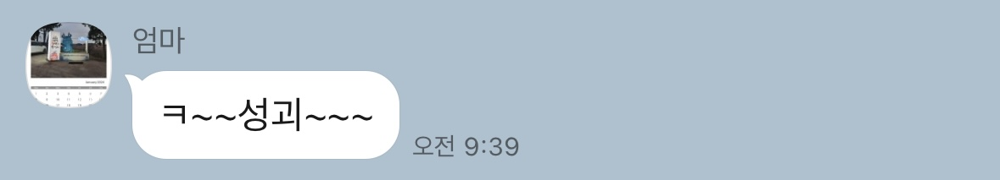
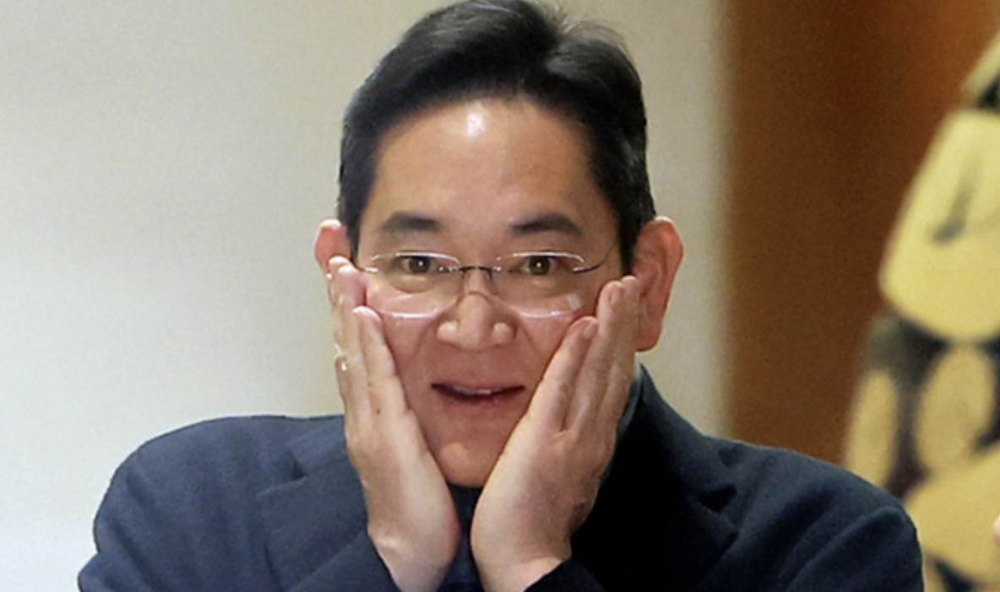

## 성괴가 되자!

엄마에게 "성괴가 되고 싶다"고 말했던 적이 있다.

"수연아.. 쌍수 했으면 됐지 또 어딜 고치려고 그러니;" 라며 답했다.

"엄마... 성형 괴물 아니고 성장하는 괴물^^"

맞다! 내 꿈은 성괴이다. 성형 괴물 아니고 성장하는 괴물! 남과 비교하는 것이 아닌 어제의 나와 비교하면서 조금씩 성장해 가고 싶다.

  

인생을 물 흘러가듯이 살아서 그리 열정적으로 살지 않았다. 늘 요행을 바라고 일단 닥치면 생각해 보자는 마인드여서 인생이 계획대로 됐던 적이 없다. 당연히 우테코 합격도 계획에 없던 일이다. 하지만 오히려 좋다~ 열정Girl~로 살 수 있게 해줄 좋은 기회일지도^^

## 모르는 것을 두려워하지 말자

우테코에는 성괴가 너무 많다. 대표적으로 말은 많지만 미션에 집중하면 멋있는 친구, 작지만 강한 친구, 은은하게 다정한 극 T 친구. 이들과 페어 프로그래밍을 진행하면서 질문을 상당히 많이 했다. 그럴 때마다 “이 정도는 알아야 하는 건가…? 너무 기초적인 걸 물어보는 건 아닐까?”라는 생각을 종종 하곤 했다. 수업 때도, "이해 안 되는 부분이 있냐"는 질문에 아무도 손을 들지 않아서 '나만 이해가 안되나? 내가 이해력이 느린 건가?' 싶었다.

매번 처음 들어 보는 용어들이 난무해서 늘 내 머릿속에는 ‘?’ 로 가득 차 있다. 모르는 게 있으면 즉시 물어 봐야 하는데 마음 속으로 질문의 기준을 정하게 된다. 그래서 소극적으로 변하게 되고, 도움을 받기만 하게 되면서 조금씩 불안감을 느끼기 시작했다. 두세 번 설명을 들어도, 솔직히 이해 못 했는데 이해한 척했던 적이 있다^^ 그때 깨달았다. 모르는 걸 두려워하고 있구나!

이런 경험이 계속되다 보니 극복해 내고자 유연성 강화 목표를 "모르는 것을 두려워하지 말자"로 정하게 되었다.

## 미쳐~버리겠다.

정말 미쳐~ 버리겠다~ 우테코에는 스윗한 사람이 너무 많다^^ 하찮은 질문에도 성심성의껏 답변해 주는 멋있는 크루들이 많다. 이젠 하다못해 리뷰어에게 반해버렸다ㅋㅋ

  

페어 중 한 명은 오히려 질문에 대한 답을 말로 설명하면서 본인도 배워가는게 있다고 했다. 아니..... 이러니 안 반할 수가 있나?? 그리고 다른 페어는 직접 종합장을 꺼내며 이해를 시키겠다는 신념 하나로 그림을 그리며 열띤 설명을 펼쳤다. 이 정도면 우테코 뽑는 기준이 다정함 일 수도...^^ 무튼 사소하지만 이런 말 한마디, 행동 하나가 쌓이고 쌓여서 큰 힘이 된다.

크론의 비동기 수업에서 페어와 퀴즈에 대한 얘기를 나눴다. 사실 질문 폭격을 날렸는데 오히려 리액션이 좋다며 칭찬을 받았다~🤣🤣 이젠 다정한 사람들이 너무 많아서 스트레스를 받을 지경까지 와버렸다^^
  

그동안 질문을 하면서 느꼈던 건데 모르는 걸 말로 잘 전달하는 게 정말 중요하다^^ 그리고 혼자 찾아서 공부하는 것보다는 질문을 통해서 답변을 들었을 때, 훨씬 기억에 오래 남고 이해가 잘되는 걸 몸소 느낄 수 있었다. 우테코 크루 덕에 뻔뻔하게 물어볼 용기를 조금은?! 얻은 것 같다! 참말로 고맙다!

  

## 레벨 1을 마무리하며

1. 새로운 기술을 배울수록 즐겁다. X 미션이 두렵다.
2. 한 달 전과 비교했을 때, 변함이 있다. △. 살짝 부지런해졌나?
3. 퇴소하고 싶었던 적이 있다. O 자주. ex) 연극.
4. 코딩을 할수록 즐겁다. X 지친다.
5. 레벨2에서도 이러고 있을까 봐 심히 우려된다. OOOO!! 솔직히 레벨 2가 아닌 수료하고 나서도 이러고 있을까 봐 걱정된다^^

게으른 성격 탓에, 오히려 강압적이고, 체계적인 틀 속에 박혀서 지내야 좋은 결과를 이루어내는 편이다. 고난과 역경이 잦은 환경 속에서 시너지를 발휘한다. 레벨 2??? 하나도 두렵지 않다~ 아니..살짝 두렵다. 그렇지만 이미 들어온 이상 빠져나갈 구멍은 없다. 이미 엎질러진 물 방학 때 시원~하게 놀고! 새로운 마음으로 레벨2에 임해야겠다!

성괴가 되는 그날까지~
