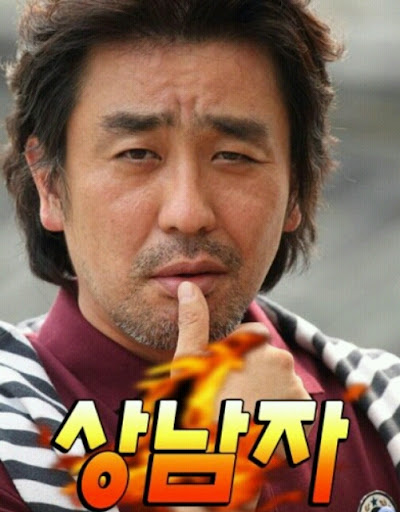

# 라이더가 아니라 배민에서 개발자 교육듣는 거라고 

우테코에 합격하고 기쁜 마음에 자랑하고 다녔다.
주변에 개발에 대해 아는 사람이 없어 우테코가 뭐냐고 물어보면 "배민에서 하는 교육~" 라고 했었다.
근데 전혀 개발과 접점이 없던 나와 매치가 안 되는지 항상 이러한 질문을 하더라
"배민 ? 뭔데 배민 라이더스하는 거가?"

 

> 왜 개발로 방향을 틀었는가

경영학과를 졸업했지만 과와 관련된 쪽으로 취업하고 싶지 않았었다.
하고 싶지 않았다기 보다는 현재를 즐기고 싶었기에, 괜찮은 직종으로 취업하기 위한 포트폴리오가 마땅히 없었다.
그리고 직장인이란 매일매일이 똑같은 일상일 거라는 게 그려져서 흥미도 없었다.

한가지 목표가 있었다면 사업이었다.
평소에 나는 아이디어를 생각해 내는 것을 좋아한다.
기발한 아이디어가 떠오르면 사업으로 큰 돈을 만지는 상상을 하며 메모해 놓고는 한다.
근데 왜 사업을 시작하지 않았냐고 물어본다면, 돈이라고 밖에 할말이 없다.
아니 어쩌면 무에서 유를 창조하는 게 귀찮았다고 할 수도 있을 것 같다.
혼자서 시작하기 위해서는 직접 발로 뛰며 알아보고 이를 구체화하기 위한 인프라도 필요 할 텐데, 난 그럴 자신이 없었다.

그렇게 진로에 대해 고민하다가 개발이라는 분야를 DevOps 부트캠프의 광고를 보고 접하게 되었다.
IT는 21세기에서 없어서는 안 될 존재이고, 큰 인프라 없이 혼자서 노트북 하나로 무에서 유를 창조할 수 있는 분야가 아닐까?
그래서 누구나 개발자를 할 수 있고 공짜라는 말에 "나도 한번..?" 이라는 생각으로 시작하게 되었다.
교육 기간은 총 4개월이었고 정말 아무것도 몰랐기에 너무나도 이해가 되지 않는 내용이 많았다.
교육 기간이 짧기 때문에 진도는 빠르게 지나가 항상 머릿속에는 궁금함으로 가득 차 있었고, 수료 후에도 머릿속은 복잡함만 남았다.
처음부터 기본도 모르고 너무 고레벨로 가다보니 (그 땐 고레벨인도 몰랐다;) "개발 나랑 안 맞네"라는 생각밖에 안 들었었다.

 

> 성과 증명 마인드 셋에서 학습 지향 마인드 셋으로

수료 후에 한 동안 또 다시 진로를 고민하다가 배달의 민족에서 운영하는 "우아한테크코스"라는 교육을 인터넷으로 접하게 되었다.
이전 교육기관에 대해서 개인적으로 많은 불만을 가지고 있었기에 이 교육이 정말 의미 있는 교육인지 많이 알아봤었다.
유튜브나 블로그들을 통해 알아본 결과 우테코를 한마디로 정의하면 "우테코는 신이야"였다.
내가 여기 들어간다면 많이 부족한 경력을 극복할 수 있지 않을까?
그때부터 마지막으로 개발을 도전해 보기로 마음먹고 처음으로 자바 언어를 공부해 보면서 5주간 우테코의 프리코스를 진행했다.
개인적으로, 우테코에서 강조하는 "몰입"을 5주간 정말 잘 경험했다고 생각한다.
하지만 5주간 노력의 결과는 좋지 못 했다.
근데 이전과는 다르게 "개발 나랑 안 맞네"라는 생각이 들지 않더라
아무래도 기본 개념을 다져가면서 다른 크루들과 생각을 공유하며 문제를 해결해 나가는 점이 재미있었기 때문인 것 같다.
그렇게 다음 우테코 모집 때는 무조건 붙어야 한다는 생각으로 1년간 쉬지 않고 공부하기 시작하며 나름의 개인 프로젝트 결과물도 만들기도 했었다.

1년이 지난 지금 나는 우테코 6기에 합격할 수 있었다.
지금과 전을 비교해 보면 "집에서 눈치 안 볼 수 있게 빨리 좋은 결과물을 만들어야 해"라는 생각을 가지고 있었기 때문에
진정으로 재미를 느끼며 임하지 않고 남에게 인정받기 급급했던 것 같다.
미션에 임할 때에도 필요에 의해서 어떠한 방식을 적용하기 보다는 다른 사람의 코드를 봤을 때 좋아 보여서 이유도 모르고 무작정 따라 해보기도 했고,
코드 리뷰도 내 코드에 대해 설명할 자신이 없어서 피했기 때문에 그냥 좋아 보이는 코드를 사용해 보여주기식이었던 것 같다.

지금은 우테코라는 목표를 가지고 1년 동안의 여유를 가지고 학습하는데 재미를 느끼며 임해 진정성이 생긴 것이 전과 다름이 아닐까?
전과 다르게 항상 이유를 찾고 그 이유를 바탕으로 어떠한 방식을 적용해 보려고 하고 
코드리뷰 또한 내 생각과 다른 사람의 생각을 공유해가며 성장해 나가는 게 재미있었다.

앞으로도 남에게 인정을 바라기 위하는 것이 아닌, 재미를 느끼며 진정성 있게 성장하려 한다.
우테코 전 과정이 다 끝난 후에는 얼마나 성장해 있을까
어른이 되고 나서 순수했던 시절을 돌이켜보며 피식 웃듯이
수료 후에 이 전을 되돌아보며 피식 웃을 수 있는 날까지 화이팅 !

