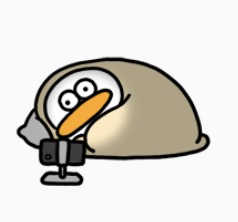
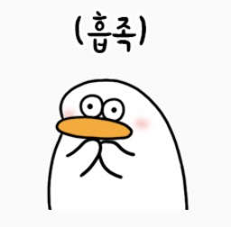
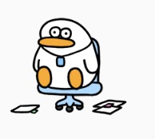

## 아직은 커뮤니케이션이 어려운 오둥이

  

  

 나는 혼자만의 시간을 갖는걸 좋아한다.
사람들과 소통하고, 많은 사람들 앞에서 목소리를 내기보다는 혼자 책을 읽으며 시간을 보내는 것이 편안하고 행복하다. 

밖으로 나가 많은 사람들과 소통을 하거나 사람들의 시선이 집중되는 것은 무섭다. 

> 내가 하는 말이 이상하지 않을까?    
> 이렇게 쉬운거 질문했다고 바보라고 생각하면 어쩌지?  
> 내가 말하는게 틀린 정보면 어떡하지?  

 하고 싶은 말이 있어도 남들이 나를 이상한 사람으로 생각할까 봐 두려워 혼자서만 입술을 다물 때가 많았다.  

### <U>사실 난 내 생각을 공유하고 싶다!</U>  

 난 `지식 공유 문화` 덕분에 개발자가 되었다.  
섬유나 만지작거렸던 비전공자인 내가 개발자가 될 수 있었던 이유는 무료로 지식을 공유해주셨던 여러 훌륭한 개발자들 덕이다.  

 나도 알고 있는 지식이나 궁금증들을 여러 사람들에게 공유하고 함께 성장해나가고 싶다.  

아직 많이 두렵지만, 우테코에서부터 지식을 공유하는 연습을 꾸준히 해보려한다.  

## 수업을 "듣지"말고 "참여"하자

  

  

 나의 첫 목표이다.  
난 살면서 한 번도 수업에 참여해본 적이 없다.  
수업에서 궁금한 점이 많았지만, 적극적으로 손을 들고 질문할 용기가 없었기 때문이다.

그러나, 이제는 남들의 시선을 신경쓰지 않겠다 다짐했고, 누구보다 수업에 열심히 `참여`하려 노력했다.

> 제이슨! 저렇게 네이밍하신 의도가 궁금합니다!!  
> TDD 가 현업에서 현실적으로 적용 가능한 것이지 궁금합니다!!  
> 리스코프치환 법칙은 ~~~ 입니다!!  
> value class는 ~~~ 입니다!!  

레벨 1을 돌이켜 보니, 수업시간에 궁금한 것이 있을 때 질문을 했고, 아는 것이 있다면 적극적으로 손을 들고 대답을 했다.

## 정말이지 후련하다

  

  

그동안, 왜 굳이 남들의 시선을 두려워해서 성장할 수 있는 기회를 날려버렸는지 후회가 됐다.  

수업이 끝나고, 궁금했던 질문을 대신 해줘서 고맙다는 크루들도 있었다.  

단순히 수업에만 열심히 참여했을 뿐인데 크루원들의 성장에도 도움이 됐다는 사실이 상당히 흡족하다.

앞으로 항상 어떤 수업이던지, 궁금한게 있다면 손 들고 질문해야겠다고 다짐한다.(당연히, 수업에 지장이 안가는 선에서😅)  

## 그러나, 아직이다.   

  

  

오프라인에서는 남들의 표정을 보면서 내가 말을 할 때 상대방이 어떤 기분인지 파악할 수 있었다.
하지만, 온라인은 아니다.  
온라인에서는 상대방이 어떤 생각을 하는지 알 수가 없다.

최근에 친구와 1주일 1블로그 챌린지를 시작했다.  
매주 내 블로그를 slack에 공유하리라!! 라는 다짐을 했지만, 몇 백명이 있는 곳에 내 글을 공유할 자신이 들지 않는다.  

아직은 두렵다.  
후.. 언제쯤 이 두려움을 이겨낼 수 있을까..?  
아직은 부끄럽지만, 조금 더 적극적인 오둥이가 되도록 노력해보겠다!  